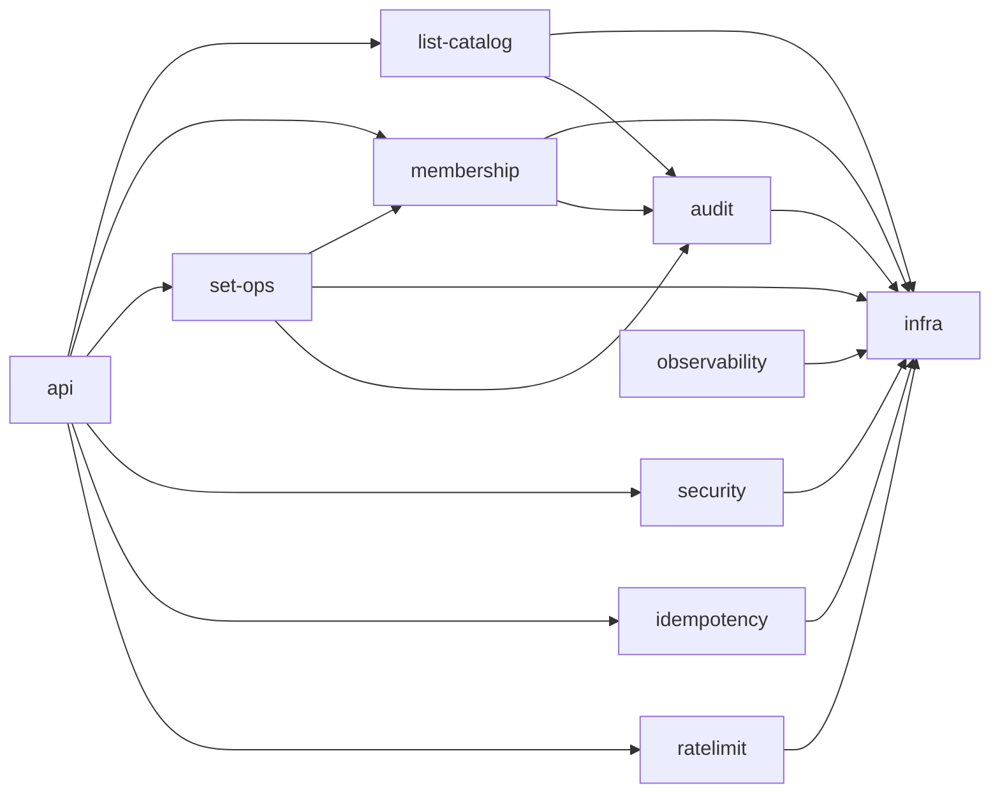

# Architecture — CIRI Chemical List Service
Guided by **Spring Modulith** principles: explicit module boundaries, limited dependencies, and event-driven collaboration where useful. This document defines the module map, responsibilities, dependency rules, event contracts, and testing strategy so the codebase remains evolvable at scale.

---

## 1) Architecture Style

- The service **should** follow a *modulith* architecture inside a single Spring Boot application.
- Modules **should** expose functionality through clearly named facades or REST controllers.
- Cross-module collaboration **should** occur via:
  - Direct calls through exported interfaces for same-transaction operations.
  - **Spring events** for decoupled, eventually consistent flows such as audit logging.
- Each module **should** “own” its data structures and Redis keys. No other module accesses a module’s keys directly.

---

## 2) Module Map

The system is decomposed into the following application modules. Each module is an implementation unit with its own package root and internal subpackages.

| Module | Purpose | Exports | Owns (Redis keys) | Publishes Events |
|---|---|---|---|---|
| **api** | REST controllers, DTOs, RFC 9457 mapping | Controllers, Problem handler | none | none |
| **list-catalog** | CRUD for list metadata | `ListCatalogFacade` | `list:{id}:meta`, `list:index:*`, `lists` | `ListCreated`, `ListUpdated`, `ListDeleted` |
| **membership** | Add, remove, query chemicals in a list | `MembershipFacade` | `list:{id}:members` | `ChemicalsAdded`, `ChemicalsRemoved` |
| **set-ops** | Union, intersection, difference, symmetric-diff into a target list | `SetOpsFacade` | writes to `list:{target}:members` | `SetOperationCompleted` |
| **security** | AuthN/AuthZ strategy, roles, API keys | `SecurityFacade` | none | none |
| **idempotency** | Handles Idempotency-Key storage and replay safety | `IdempotencyService` | `idem:{fingerprint}` | none |
| **ratelimit** | Token-bucket limits for read and write paths | `RateLimiter` | `rl:{key}` | none |
| **audit** | Immutable audit trail for writes | `AuditSink` | `audit:{yyyyMMdd}` | consumes domain events |
| **observability** | Metrics, tracing, correlation IDs | Metrics registry, filters | none | consumes domain events |
| **infra** | Redis connectors, key naming, transactional helpers | Connection factories | none | none |

> Notes  
> 1) `api` depends on facades only.  
> 2) `set-ops` depends on `membership` only through exported facade and never touches Redis keys directly.  
> 3) `audit` and `observability` consume events but are not depended upon by business modules.

---

## 3) Allowed Dependencies

The following compile-time dependencies define the allowed edges between modules:



Rules:
* No module other than membership writes to list:{id}:members.
* api calls only exported facades, not internal services.
* No cyclic dependencies between modules.

## 4) Package Layout

```
org.ul.ciri
├─ api
│  ├─ controller
│  ├─ dto
│  └─ error
├─ listcatalog
│  ├─ app (facade)
│  ├─ domain
│  ├─ data
│  └─ internal
├─ membership
│  ├─ app (facade)
│  ├─ domain
│  ├─ data
│  └─ internal
├─ setops
│  ├─ app (facade)
│  ├─ domain
│  └─ internal
├─ security
│  ├─ config
│  └─ app
├─ idempotency
│  └─ app
├─ ratelimit
│  └─ app
├─ audit
│  ├─ app
│  └─ consumer
├─ observability
│  ├─ metrics
│  └─ tracing
└─ infra
   ├─ redis
   ├─ keys
   └─ config
```
Each module root should be annotated for Spring Modulith scanning where applicable.

## 5) Module Responsibilities

### 5.1 api
- Maps HTTP to facades.  
- Returns **RFC 9457 Problem Details** on error.  
- Performs request validation and pagination decoding.  
- Does **not** contain business logic.  

---

### 5.2 list-catalog
- Creates and updates list metadata.  
- Maintains indexes:  
  - `list:index:name`  
  - `list:index:label`  
  - Membership in lists.  
- Emits:  
  - `ListCreated`  
  - `ListUpdated`  
  - `ListDeleted`  

---

### 5.3 membership
- Owns `list:{listId}:members` set.  
- Single add uses `SADD`.  
- Batch add uses pipelined `SISMEMBER` or `SMISMEMBER` and `SADD`.  
- Read operations use:  
  - `SSCAN` for pagination  
  - `SCARD` for counts  
- Emits:  
  - `ChemicalsAdded`  
  - `ChemicalsRemoved`  

---

### 5.4 set-ops
- Accepts `{ "sourceListIds": [...] }` and populates `list:{targetListId}:members`.  
- Uses `SUNIONSTORE`, `SINTERSTORE`, `SDIFFSTORE`.  
- Symmetric difference via **union minus intersection**.  
- Updates `lastUpdateBy` and `lastUpdateDate` in list-catalog.  
- Emits:  
  - `SetOperationCompleted`  

---

### 5.5 security
- Provides **INMEMORY**, **OIDC**, and **API_KEY** modes.  
- Exposes method security annotations and role mapping.  
- **Public:** `GET`  
- **Authenticated:** `POST`, `PUT`, `PATCH`, `DELETE`  

---

### 5.6 idempotency
- Stores request fingerprints under `idem:{hash}` with **TTL**.  
- On duplicate key, returns stored result metadata.  
- Applied to **POST** and **batch** endpoints.  

---

### 5.7 ratelimit
- **Token bucket** per principal or IP.  
- Separate policies for **read** and **write** paths.  
- Keys under `rl:{scope}:{key}`.  

---

### 5.8 audit
- Subscribes to domain events.  
- Persists immutable audit entries under `audit:{yyyyMMdd}` lists or streams.  
- Provides an internal query API for admins.  

---

### 5.9 observability
- HTTP filter adds **correlation IDs**.  
- Exposes metrics for:  
  - Redis latency  
  - Batch sizes  
  - Set-op durations  
- Integrates with **Actuator** and **OpenTelemetry**.  

---

### 5.10 infra
- Centralized Redis connection factory and templates.  
- Key naming utilities to prevent collisions.  
- Optional script support for atomic multi-ops where needed.  

